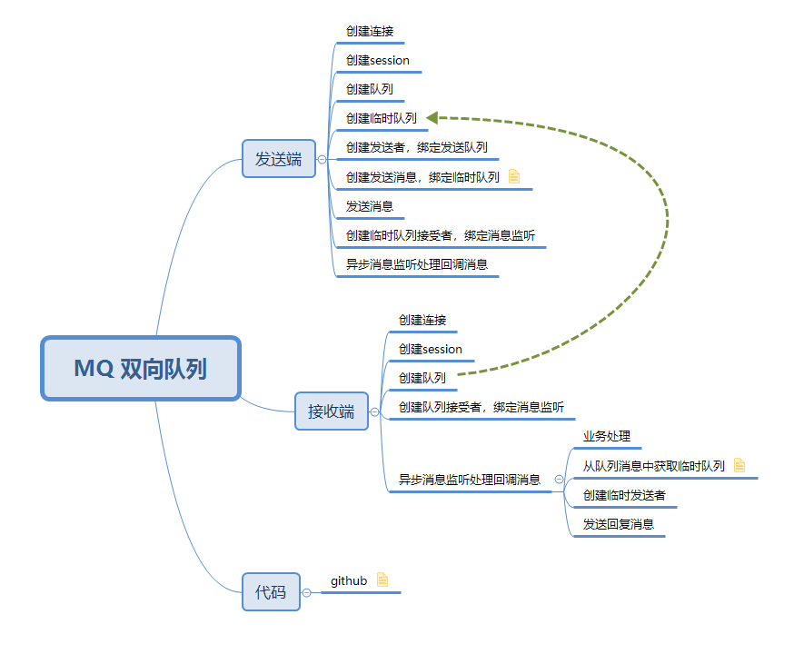

# 功能
## 发送异步消息，并创建临时队列接收异步返回。
见 ProducerAsyn 和 ConsumerAsyn 
* 
## 关闭消息监听
以便应用停止时调用，避免无法关闭应用，和消息处理一半导致丢失问题 见 StopJmsListener
```$xslt

    /**
     * 关闭JMS监听，不再接受消息
     */
    public void stop()
    {
        Collection<MessageListenerContainer> listenerContainers = jmsListenerEndpointRegistry.getListenerContainers();
        for (Iterator<MessageListenerContainer> iterator = listenerContainers.iterator(); iterator.hasNext(); ) {
            MessageListenerContainer next =  iterator.next();
            next.stop();
        }
    }
```


# 测试
测试见controller里面的测试方法
- http://127.0.0.1:43343/swagger-ui.html#/